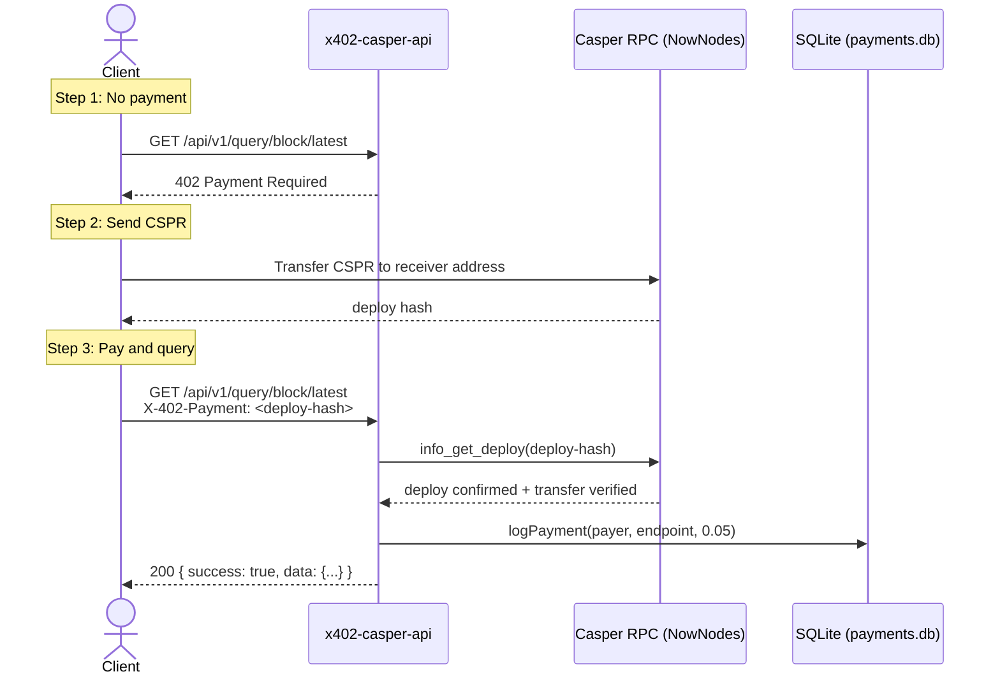

# x402-casper-api

Pay-per-query for Casper blockchain data.  
No API keys. No accounts. No subscriptions.  
One CSPR transfer. One query. $0.05.



## Quick start

```bash
npm install
npm run build
cp .env.example .env
# edit .env — set X402_RECEIVER to your wallet
npm start
```

## Required config

```bash
# .env — secrets only, everything else is in config.ts
X402_RECEIVER=         # wallet that collects payments
NOWNODES_KEY=          # optional — NowNodes API key
```

The receiver address is a Casper account public key. All CSPR payments go here.  
When `NOWNODES_KEY` is set, all RPC traffic routes through NowNodes instead of the public endpoint.

## Endpoints

### Paid — require `X-402-Payment: <deploy-hash>` header

| Method | Path | Params |
|--------|------|--------|
| GET | `/api/v1/query/block/latest` | — |
| GET | `/api/v1/query/block` | `?height=` |
| GET | `/api/v1/query/balance` | `?key=` |
| GET | `/api/v1/query/deploy` | `?hash=` |
| GET | `/api/v1/query/validators` | — |
| GET | `/api/v1/query/network` | — |
| GET | `/api/v1/query/transfers` | `?count=` |

### Free

| Method | Path | Description |
|--------|------|-------------|
| GET | `/api/v1/health` | Server and chain status |
| GET | `/api/v1/stats` | Payment revenue statistics |

## Payment flow

```bash
# 1. Send CSPR to the receiver wallet on Casper testnet.
#    Take the deploy hash from the transfer.

# 2. Call any paid endpoint with the deploy hash as proof:
curl -H "X-402-Payment: a1b2c3d4e5f6a7b8c9d0e1f2a3b4c5d6" \
  https://your-app.railway.app/api/v1/query/block/latest

# 3. Server calls info_get_deploy on-chain, verifies:
#    - execution succeeded
#    - transfer target matches X402_RECEIVER
#    - proof not replayed

# 4. Data returned. Payment logged.
```

## NowNodes

When you set `NOWNODES_KEY` in `.env`, the server switches from the public Casper RPC endpoint to `https://casper.nownodes.io` with your API key in the request header. Both the data queries and the payment verification deploys go through NowNodes.

```
config.ts detects:
  NOWNODES_KEY set  →  fetch(nownodesUrl, { headers: { 'api-key': key } })
  NOWNODES_KEY not set →  fetch(rpcUrl) (public endpoint)
```

## Railway deployment

```bash
# 1. Push to GitHub
git push

# 2. In Railway:
#    New Project → Deploy from GitHub → select repo
#    Add variables:
#      X402_RECEIVER=your-wallet-public-key
#      NOWNODES_KEY=your-nownodes-key (optional)

# 3. Railway builds with `npm run build` and starts with `npm start`
```

Railway provides a public URL like `https://x402-casper.up.railway.app`. Use this as the base for all API calls.

## How payment verification works

The `X-402-Payment` header value is a Casper deploy hash. The server:

1. Calls `info_get_deploy` to fetch the deploy from the chain
2. Checks execution results — must be `Success`
3. Parses execution effects for `WriteTransfer` transforms
4. Confirms the transfer target matches the configured receiver
5. Marks the deploy hash as used (replay protection)

No mock verification. No string parsing. Real RPC calls.

## Files

```
config.ts              port, rpc urls, receiver, api keys
server.ts              route definitions
middleware/x402.ts     on-chain payment verification
services/casper.ts     casper rpc client (supports NowNodes)
services/payments.ts   sqlite payment log
public/index.html      landing page
```
